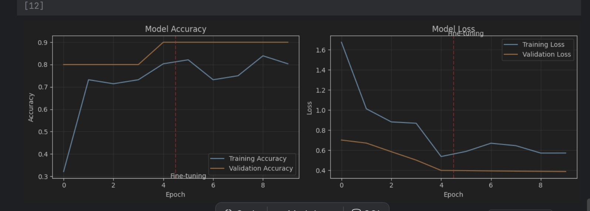
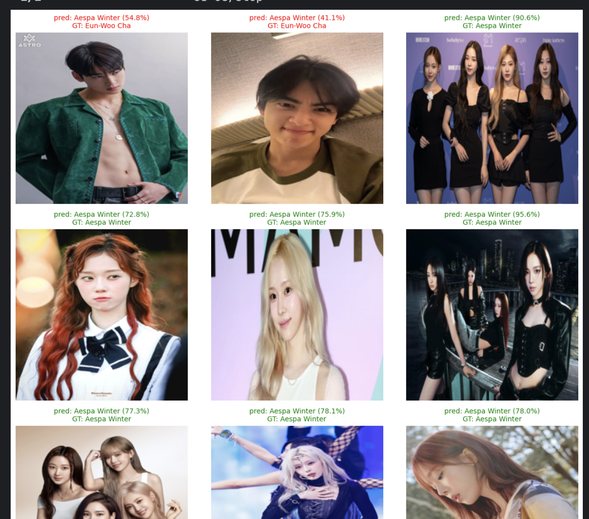

# 🤖 Celebrity Image Classifier (Transfer Learning with MobileNetV2)

An advanced **Transfer Learning** project built with TensorFlow and **MobileNetV2**, trained on real images automatically downloaded using the **Bing Image Downloader**.  
The model classifies between **Aespa Winter**, **Eun-Woo Cha**, and **Bruce Lee** with two-stage training (Feature Extraction + Fine-tuning).

---

## 🎥 Preview & Screenshot

<table align="center">
  <tr>
    <td align="center">
      
       📊 Accuracy & Loss Curves
    </td>

<td align="center">
      
       📊 Accuracy & Loss Curves
    </td>
  </tr>
</table>

---

## 🧩 Key Features

- 🖼️ **Automatic image collection** via Bing Image Downloader  
- 🔄 **Transfer Learning** using pre-trained **MobileNetV2 (ImageNet)**  
- 🧠 Two-stage training:
  1. **Feature Extraction** (frozen base)
  2. **Fine-tuning** (top layers unfrozen)
- 🧰 **Custom classifier head** for multi-class classification  
- 🎨 **Visualization of training & predictions**

---

## ⚙️ Technologies Used

| Component | Description |
|------------|--------------|
| **TensorFlow / Keras** | Deep learning framework |
| **MobileNetV2** | Pre-trained CNN base |
| **Bing Image Downloader** | Automatic dataset creation |
| **Matplotlib / PIL** | Visualization & image handling |
| **NumPy / scikit-learn** | Data manipulation & splitting |

---

## 📂 Project Structure

